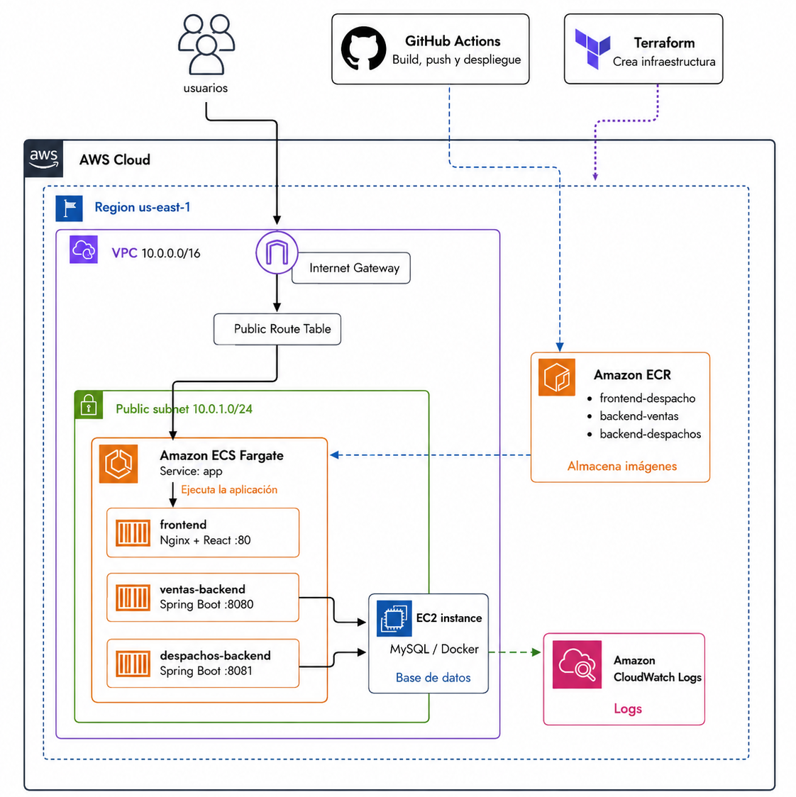

# ProyectoSemestral_2 - Despliegue con Docker, Terraform, ECR y ECS

## Descripción del proyecto

Proyecto web contenerizado y desplegado en AWS. La aplicación está compuesta por un frontend, dos servicios backend y una base de datos MySQL.

El proyecto permite ejecutar el sistema de forma local con Docker Compose y desplegarlo en AWS usando Terraform, Amazon ECR, Amazon ECS Fargate, EC2 y GitHub Actions.

---

## Diagrama de arquitectura

A continuación se muestra la arquitectura desplegada en AWS para el proyecto:



---

## Tecnologías utilizadas

- Docker
- Docker Compose
- Terraform
- GitHub Actions
- AWS CLI
- Amazon ECR
- Amazon ECS Fargate
- Amazon EC2
- Amazon CloudWatch
- React
- Nginx
- Spring Boot
- MySQL 8.0

---

## Servicios del proyecto

| Servicio | Tecnología | Puerto | Descripción |
|---|---|---:|---|
| Frontend | React + Nginx | 80 | Interfaz web |
| Ventas Backend | Spring Boot | 8080 | Servicio de ventas |
| Despachos Backend | Spring Boot | 8081 | Servicio de despachos |
| MySQL | MySQL 8.0 | 3306 | Base de datos |

---

## Estructura principal

```txt
ProyectoSemestral_2/
│
├── .github/
│   └── workflows/
│       └── deploy.yml
│
├── Backend/
│   ├── back-Ventas_SpringBoot/
│   └── back-Despachos_SpringBoot/
│
├── Frontend/
│   └── front_despacho/
│       ├── dockerfile
│       ├── dockerfile.ecs
│       ├── nginx.conf
│       └── nginx.ecs.conf
│
├── infra/
│   └── terraform/
│       ├── compute.tf
│       ├── ecr.tf
│       ├── ecs.tf
│       ├── security.tf
│       ├── provider.tf
│       ├── variables.tf
│       └── outputs.tf
│
├── docs/
│   └── ArquitecturaAws.png
│
├── docker-compose.yml
└── README.md
```

---

## Ejecución local

Para levantar el proyecto localmente se usa Docker Compose.

Desde la raíz del proyecto:

```bash
docker compose up --build
```

Para detener los servicios:

```bash
docker compose down
```

Accesos locales:

| Servicio | URL |
|---|---|
| Frontend | `http://localhost` |
| Ventas Backend | `http://localhost:8080` |
| Despachos Backend | `http://localhost:8081` |
| MySQL | `localhost:3306` |

---

## Variables de entorno locales

Los backend usan estas variables para conectarse a MySQL:

```txt
DB_ENDPOINT=mysql-db
DB_PORT=3306
DB_NAME=innovatech_db
DB_USERNAME=innovatech
DB_PASSWORD=innovatech123
```

---

## Infraestructura con Terraform

La infraestructura se encuentra en:

```txt
infra/terraform
```

Terraform crea los siguientes recursos en AWS:

- Repositorios Amazon ECR.
- Instancia EC2 para MySQL.
- Security Group.
- Cluster ECS.
- Task Definition.
- ECS Service.
- CloudWatch Log Group.

---

## Comandos Terraform

Entrar a la carpeta de Terraform:

```bash
cd infra/terraform
```

Inicializar Terraform:

```bash
terraform init
```

Revisar los recursos que se crearán:

```bash
terraform plan
```

Crear la infraestructura:

```bash
terraform apply
```

Cuando Terraform pregunte, escribir:

```txt
yes
```

Para eliminar la infraestructura:

```bash
terraform destroy
```

---

## Configuración de AWS Academy

Antes de usar Terraform, se deben configurar las credenciales de AWS Academy.

Ejemplo en PowerShell:

```powershell
$env:AWS_ACCESS_KEY_ID="ACCESS_KEY_REAL"
$env:AWS_SECRET_ACCESS_KEY="SECRET_KEY_REAL"
$env:AWS_SESSION_TOKEN="SESSION_TOKEN_REAL"
$env:AWS_DEFAULT_REGION="us-east-1"
```

Para comprobar que funciona:

```powershell
aws sts get-caller-identity
```

---

## Amazon ECR

Se crean tres repositorios para guardar las imágenes Docker:

```txt
frontend-despacho
backend-ventas
backend-despachos
```

Las imágenes son construidas y subidas automáticamente por GitHub Actions.

---

## Amazon ECS Fargate

Se creó un cluster ECS llamado:

```txt
proyectosemestral2-cluster
```

Dentro del cluster se creó un servicio llamado:

```txt
app
```

La task de ECS ejecuta tres contenedores:

```txt
frontend
ventas-backend
despachos-backend
```

---

## Base de datos en EC2

La base de datos MySQL se ejecuta en una instancia EC2.

Terraform instala Docker en la instancia y levanta un contenedor MySQL con la base de datos:

```txt
innovatech_db
```

Esta decisión permite mantener una arquitectura simple, similar al ejemplo trabajado en clases.

---

## GitHub Actions

El proyecto utiliza GitHub Actions para automatizar el proceso de construcción, publicación y despliegue de los contenedores en AWS.

El workflow se encuentra en:

```txt
.github/workflows/deploy.yml
```

Este pipeline se ejecuta automáticamente cada vez que se realiza un push a la rama:

```txt
deploy
```

---

## Flujo del pipeline CI/CD

En la ejecución del workflow se realizan los siguientes pasos:

| Paso | Acción | Descripción |
|---|---|---|
| 1 | Set up job | Prepara el ambiente de ejecución en GitHub Actions |
| 2 | Checkout repository | Descarga el código del repositorio |
| 3 | Configure AWS credentials | Configura las credenciales de AWS Academy para permitir la conexión con AWS |
| 4 | Login to Amazon ECR | Inicia sesión en Amazon ECR para poder subir imágenes Docker |
| 5 | Build and push frontend image | Construye y sube la imagen Docker del frontend a ECR |
| 6 | Build and push backend ventas image | Construye y sube la imagen Docker del backend de ventas a ECR |
| 7 | Build and push backend despachos image | Construye y sube la imagen Docker del backend de despachos a ECR |
| 8 | Force new deployment in ECS | Fuerza una nueva implementación del servicio en ECS |
| 9 | Complete job | Finaliza el proceso de despliegue |

---

## Qué hace GitHub Actions en el proyecto

GitHub Actions se encarga de automatizar el despliegue de la aplicación. Antes, el proceso podía realizarse manualmente construyendo imágenes Docker, subiéndolas a AWS y actualizando los servicios, pero ahora todo queda automatizado desde el repositorio.

El flujo general es el siguiente:

```txt
GitHub Actions
   |
   v
Construye imágenes Docker
   |
   v
Sube imágenes a Amazon ECR
   |
   v
Actualiza el servicio en Amazon ECS
   |
   v
ECS ejecuta los contenedores actualizados
```

---

## Imágenes construidas y publicadas

El pipeline construye tres imágenes Docker:

```txt
frontend-despacho
backend-ventas
backend-despachos
```

Luego las publica en Amazon ECR con el tag:

```txt
latest
```

Esto permite que ECS Fargate pueda descargar las imágenes más recientes y ejecutar la aplicación actualizada.

---

## Actualización del servicio ECS

Al finalizar la construcción y subida de imágenes a ECR, el workflow ejecuta una actualización del servicio ECS.

El comando utilizado es:

```bash
aws ecs update-service \
  --cluster proyectosemestral2-cluster \
  --service app \
  --force-new-deployment
```

Este comando obliga a ECS a crear una nueva implementación del servicio `app`, usando las imágenes más recientes almacenadas en ECR.

---

## Resultado esperado del workflow

Cuando el workflow termina correctamente, GitHub Actions muestra todos los pasos con check verde, como evidencia de que el pipeline se ejecutó de forma correcta.

Esto confirma que:

- Las credenciales de AWS fueron configuradas correctamente.
- GitHub Actions pudo conectarse a Amazon ECR.
- Las imágenes Docker fueron construidas correctamente.
- Las imágenes fueron subidas a ECR.
- El servicio ECS fue actualizado.
- La aplicación quedó lista para ejecutarse en ECS Fargate.

---

## Secrets necesarios en GitHub

En GitHub se deben agregar en:

```txt
Settings > Secrets and variables > Actions
```

### Secrets

```txt
AWS_ACCESS_KEY_ID
AWS_SECRET_ACCESS_KEY
AWS_SESSION_TOKEN
```

### Variables

```txt
AWS_REGION=us-east-1
AWS_ACCOUNT_ID=ID_DE_LA_CUENTA_AWS
ECR_FRONTEND_REPOSITORY=frontend-despacho
ECR_VENTAS_REPOSITORY=backend-ventas
ECR_DESPACHOS_REPOSITORY=backend-despachos
```

---

## Validación en AWS

Después del despliegue, revisar:

### ECR

Verificar que cada repositorio tenga una imagen con tag:

```txt
latest
```

Repositorios esperados:

```txt
frontend-despacho
backend-ventas
backend-despachos
```

### ECS

Ingresar a:

```txt
ECS > Clusters > proyectosemestral2-cluster > Services > app
```

La task debe quedar en estado:

```txt
Running
```

### CloudWatch

Revisar logs en:

```txt
CloudWatch > Log groups
```

Ahí se pueden revisar los logs de:

```txt
frontend
ventas
despachos
```

### IP pública

Cuando la task esté en estado `Running`, ingresar a:

```txt
ECS > Cluster > Tasks > Task en ejecución > Networking
```

Copiar la IP pública y abrir:

```txt
http://IP_PUBLICA
```

---

## Archivos principales modificados o agregados

```txt
.github/workflows/deploy.yml
infra/terraform/ecs.tf
infra/terraform/compute.tf
infra/terraform/security.tf
infra/terraform/ecr.tf
infra/terraform/outputs.tf
Frontend/front_despacho/dockerfile.ecs
Frontend/front_despacho/nginx.ecs.conf
docker-compose.yml
docs/ArquitecturaAws.png
```

---

## Estado final del proyecto

El proyecto queda con:

- Ejecución local mediante Docker Compose.
- Imágenes Docker para frontend y backend.
- Repositorios ECR creados.
- Infraestructura creada con Terraform.
- ECS Fargate ejecutando frontend y backend.
- MySQL ejecutándose en EC2.
- Pipeline CI/CD con GitHub Actions.
- Logs disponibles en CloudWatch.
- Acceso público mediante la IP pública de la task ECS.